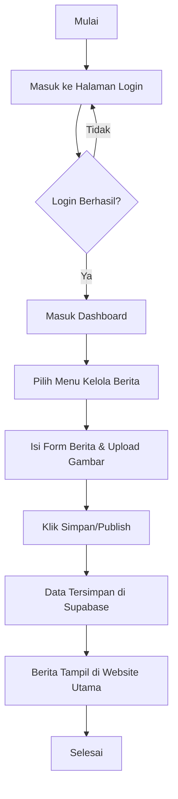
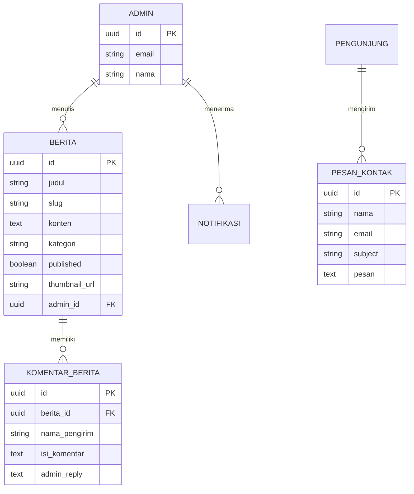

# BUKU PANDUAN PENGGUNAAN & INSTALASI
## WEBSITE PROFIL SMPN 2 TANJUNGKERTA
**Oleh: Abiel (Freelance Web Developer)**

---

### DAFTAR ISI
1. [PENDAHULUAN](#1-pendahuluan)
2. [SISTEM PERANCANGAN (DIAGRAM)](#2-sistem-perancangan-diagram)
3. [SPESIFIKASI PERANGKAT](#3-spesifikasi-perangkat)
4. [PANDUAN INSTALASI](#4-panduan-instalasi)
5. [PANDUAN PENGGUNAAN (ADMIN & PENGUNJUNG)](#5-panduan-penggunaan-admin--pengunjung)

---

### 1. PENDAHULUAN
Website Profil SMPN 2 Tanjungkerta adalah platform informasi digital yang dikembangkan untuk memudahkan penyampaian berita, pengumuman, dan informasi akademik kepada siswa, orang tua, dan masyarakat. Website ini dibangun menggunakan teknologi modern seperti **Next.js**, **Tailwind CSS**, dan **Supabase**.

---

### 2. SISTEM PERANCANGAN (DIAGRAM)

#### A. Flowchart (Alur Kerja Admin)
Diagram ini menjelaskan langkah admin dalam mengelola konten (misal: Berita).



#### B. Use Case Diagram
Menggambarkan interaksi aktor (Admin & Pengunjung) dengan sistem.

```mermaid
useCaseDiagram
    actor "Admin Sekolah" as Admin
    actor "Pengunjung/Siswa" as User

    package "Website SMPN 2 Tanjungkerta" {
        usecase "Login ke Dashboard" as UC1
        usecase "Kelola Berita & Pengumuman" as UC2
        usecase "Kelola Data Guru & Ekskul" as UC3
        usecase "Monitoring Pesan Masuk" as UC4
        usecase "Melihat Profil Sekolah" as UC5
        usecase "Melihat Galeri & Berita" as UC6
        usecase "Mengirim Pesan Kontak" as UC7
    }

    Admin --> UC1
    Admin --> UC2
    Admin --> UC3
    Admin --> UC4
    
    User --> UC5
    User --> UC6
    User --> UC7
```

#### C. Entity Relationship Diagram (ERD)
Struktur database pada Supabase.



---

### 3. SPESIFIKASI PERANGKAT

#### A. Kebutuhan Perangkat Keras (Hardware)
*   **Processor:** Minimal Intel Core i3 (atau setara).
*   **RAM:** Minimal 4 GB (Disarankan 8 GB untuk pengembangan).
*   **Penyimpanan:** Minimal 1 GB ruang kosong.
*   **Koneksi:** Internet aktif untuk akses Supabase API.

#### B. Perangkat Lunak (Software)
*   **Sistem Operasi:** Windows 10/11, macOS, atau Linux.
*   **Web Browser:** Google Chrome, Microsoft Edge, atau Mozilla Firefox versi terbaru.
*   **Runtime:** Node.js versi 18.x atau yang lebih baru.
*   **Editor:** Visual Studio Code (Opsional, untuk pengembangan).

---

### 4. PANDUAN INSTALASI

Ikuti langkah-langkah berikut untuk menjalankan aplikasi di lingkungan lokal:

1.  **Persiapkan Node.js:** Pastikan Node.js sudah terinstal (cek dengan `node -v`).
2.  **Ekstrak/Clone Project:** Buka folder project di terminal.
3.  **Instalasi Library:** Jalankan perintah berikut:
    ```bash
    npm install
    ```
4.  **Konfigurasi Environment:** Buat file `.env.local` dan isi dengan kunci API Supabase Anda:
    ```env
    NEXT_PUBLIC_SUPABASE_URL=your_supabase_url
    NEXT_PUBLIC_SUPABASE_ANON_KEY=your_supabase_anon_key
    ```
5.  **Menjalankan Aplikasi:** Jalankan perintah pengembangan:
    ```bash
    npm run dev
    ```
6.  **Akses Browser:** Buka alamat `http://localhost:3000`.

---

### 5. PANDUAN PENGGUNAAN (ADMIN & PENGUNJUNG)

#### A. Panduan Mengelola Berita (Admin)
Langkah-langkah untuk menambah berita baru:
1.  Buka halaman **Dashboard > Berita**.
2.  Klik tombol **"Tambah Berita Baru"**.
3.  Isi **Judul Berita** (Slug akan terisi otomatis).
4.  Pilih **Kategori** (misal: "Kegiatan", "Prestasi").
5.  Klik area **Upload Thumbnail** untuk mengunggah gambar sampul berita.
6.  Tulis isi berita menggunakan **Editor Teks** (Tiptap Editor).
7.  Pilih Status **"Publish"** agar langsung tampil di website utama.
8.  Klik **"Simpan"**.

#### B. Panduan Mengelola Galeri
1.  Masuk ke menu **Dashboard > Galeri**.
2.  Pilih file foto kegiatan sekolah.
3.  Berikan keterangan singkat pada foto.
4.  Klik **"Simpan"**. Foto akan otomatis muncul di halaman depan bagian Galeri.

#### C. Panduan Pengunjung
1.  **Melihat Informasi:** Pengunjung dapat mengunjungi halaman beranda untuk melihat sekilas berita terbaru dan profil singkat.
2.  **Membaca Berita:** Masuk ke menu "Berita" untuk membaca artikel lengkap.
3.  **Memberi Komentar:** Di bagian bawah setiap berita, pengunjung dapat mengisi nama dan isi komentar.
4.  **Menghubungi Sekolah:** Gunakan formulir di halaman "Kontak" untuk mengirim pesan pertanyaan langsung ke dashboard admin.

---
**Catatan:** Buku panduan ini dibuat sebagai bagian dari dokumentasi teknis project website SMPN 2 Tanjungkerta 2026.
