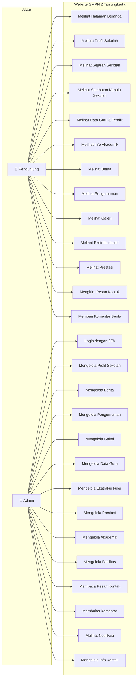
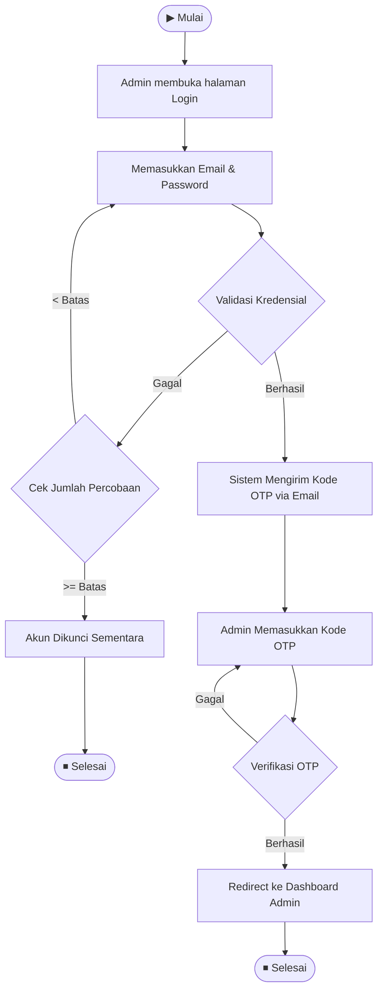
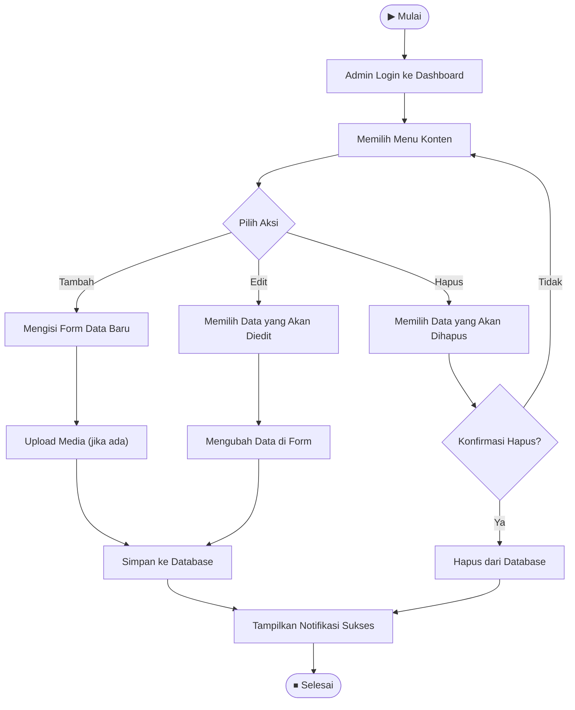
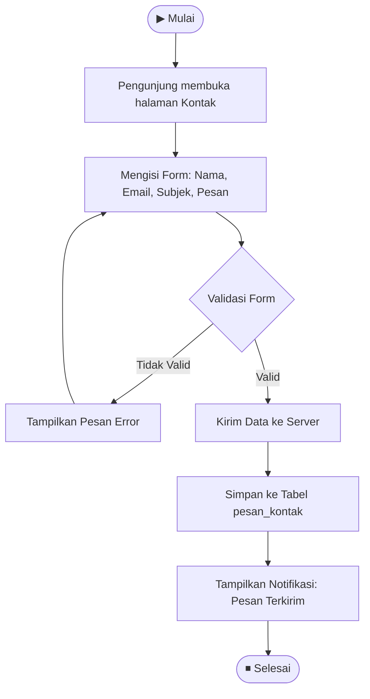
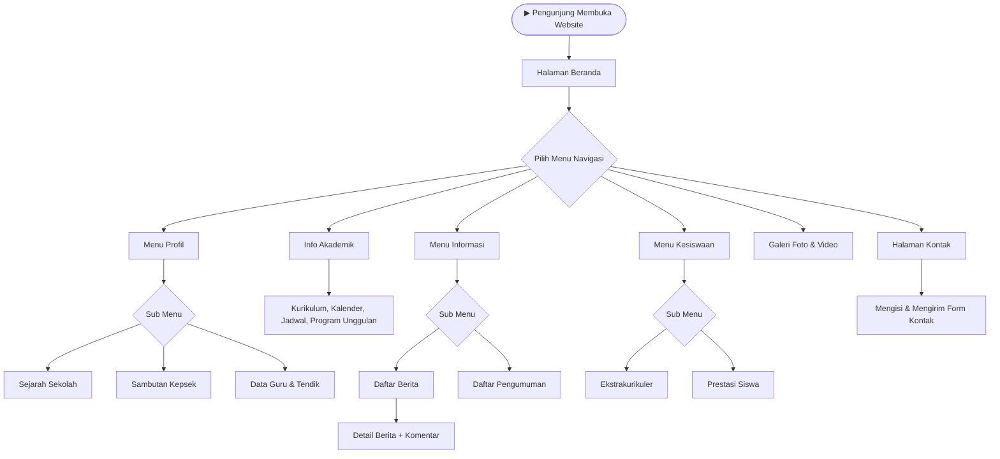
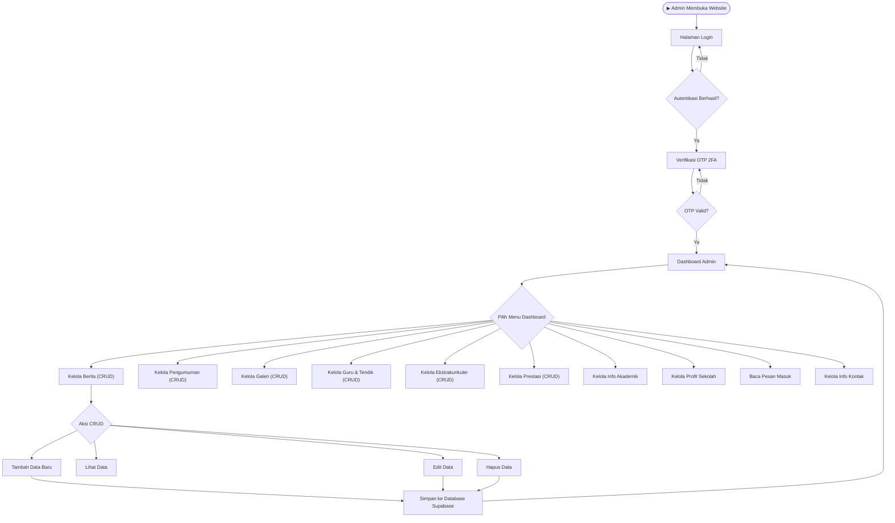

# Diagram Website SMPN 2 Tanjungkerta

Berikut adalah kumpulan diagram dalam format **Mermaid** dan kode **dbdiagram.io** untuk website SMPN 2 Tanjungkerta.

---

## 1. Use Case Diagram



---

## 2. Activity Diagram

### 2a. Activity Diagram — Login Admin (2FA)



### 2b. Activity Diagram — Manajemen Konten (CRUD oleh Admin)



### 2c. Activity Diagram — Pengunjung Mengirim Pesan Kontak



---

## 3. Flowchart

### 3a. Flowchart — Alur Navigasi Pengunjung



### 3b. Flowchart — Alur Kerja Admin Dashboard



---

## 4. Database Diagram (Kode untuk dbdiagram.io)

Salin kode di bawah ini dan paste ke [dbdiagram.io](https://dbdiagram.io/d) untuk menghasilkan ERD visual.

```
// ============================================
// DATABASE DIAGRAM — WEBSITE SMPN 2 TANJUNGKERTA
// ============================================

Table admin {
  id uuid [pk, ref: > auth_users.id]
  email text [unique, not null]
  nama text [not null]
  created_at timestamptz [not null, default: `now()`]
}

Table auth_users {
  id uuid [pk, note: 'Supabase Auth - tabel internal']
}

Table profil_sekolah {
  id uuid [pk, default: `uuid_generate_v4()`]
  nama_sekolah text [not null, default: 'SMP Negeri 2 Tanjungkerta']
  npsn text [not null, default: '-']
  sejarah text
  visi text
  misi text
  struktur_organisasi_url text
  sambutan_kepsek text
  foto_kepsek text
  nama_kepsek text
  jumlah_siswa int [default: 0]
  jumlah_guru int [default: 0]
  jumlah_ekskul int [default: 0]
  alamat text
  telepon text
  email text
  maps_url text
  jam_operasional text
  instagram text
  facebook text
  youtube text
  updated_at timestamptz [not null, default: `now()`]

  Note: 'Tabel single-row berisi profil utama sekolah'
}

Table berita {
  id uuid [pk, default: `uuid_generate_v4()`]
  judul text [not null]
  slug text [unique, not null]
  konten text [not null]
  kategori text [not null, default: 'Umum']
  thumbnail_url text
  published boolean [default: false]
  published_at timestamptz
  created_at timestamptz [not null, default: `now()`]
  admin_id uuid [ref: > admin.id]

  Note: 'Artikel berita sekolah'
}

Table pengumuman {
  id uuid [pk, default: `uuid_generate_v4()`]
  judul text [not null]
  konten text [not null]
  tanggal_berlaku date [not null]
  featured boolean [default: false]
  aktif boolean [default: true]
  created_at timestamptz [not null, default: `now()`]
  admin_id uuid [ref: > admin.id]

  Note: 'Pengumuman resmi sekolah'
}

Table galeri {
  id uuid [pk, default: `uuid_generate_v4()`]
  judul text [not null]
  deskripsi text
  media_url text [not null]
  media_type text [not null, default: 'image']
  kategori text [not null, default: 'Kegiatan']
  tanggal_kegiatan date
  created_at timestamptz [not null, default: `now()`]

  Note: 'Foto dan video kegiatan sekolah'
}

Table guru {
  id uuid [pk, default: `uuid_generate_v4()`]
  nama text [not null]
  nip text
  jabatan text [not null]
  mata_pelajaran text
  tipe text [not null, default: 'guru']
  pendidikan_terakhir text
  foto_url text
  aktif boolean [default: true]
  urutan int [default: 0]
  created_at timestamptz [not null, default: `now()`]

  Note: 'Data guru dan tenaga kependidikan'
}

Table ekskul {
  id uuid [pk, default: `uuid_generate_v4()`]
  nama text [not null]
  deskripsi text
  pembina text
  jadwal text
  foto_url text
  aktif boolean [default: true]
  created_at timestamptz [not null, default: `now()`]

  Note: 'Daftar ekstrakurikuler'
}

Table prestasi {
  id uuid [pk, default: `uuid_generate_v4()`]
  nama_prestasi text [not null]
  nama_siswa text [not null]
  tingkat text [not null]
  tahun int [not null]
  kategori text [not null]
  foto_url text
  created_at timestamptz [not null, default: `now()`]

  Note: 'Prestasi siswa dan sekolah'
}

Table akademik {
  id uuid [pk, default: `uuid_generate_v4()`]
  kurikulum text [not null, default: 'Merdeka Belajar']
  deskripsi_kurikulum text
  kalender_akademik_url text
  jadwal_pelajaran_url text
  updated_at timestamptz [not null, default: `now()`]

  Note: 'Tabel single-row info akademik'
}

Table program_unggulan {
  id uuid [pk, default: `uuid_generate_v4()`]
  nama text [not null]
  deskripsi text [not null]
  ikon text
  urutan int [default: 0]
  aktif boolean [default: true]
  akademik_id uuid [ref: > akademik.id]

  Note: 'Program unggulan bagian dari akademik'
}

Table fasilitas {
  id uuid [pk, default: `uuid_generate_v4()`]
  nama text [not null]
  deskripsi text
  foto_url text
  urutan int [default: 0]
  aktif boolean [default: true]
  created_at timestamptz [not null, default: `now()`]

  Note: 'Fasilitas yang dimiliki sekolah'
}

Table pesan_kontak {
  id uuid [pk, default: `uuid_generate_v4()`]
  nama_pengirim text [not null]
  email_pengirim text [not null]
  subjek text [not null]
  pesan text [not null]
  sudah_dibaca boolean [default: false]
  created_at timestamptz [not null, default: `now()`]

  Note: 'Pesan dari pengunjung ke admin'
}

Table notifikasi {
  id uuid [pk, default: `uuid_generate_v4()`]
  judul text [not null]
  pesan text [not null]
  tipe text [not null, default: 'info']
  link_tuju text
  dibaca boolean [default: false]
  created_at timestamptz [not null, default: `now()`]

  Note: 'Notifikasi in-app untuk admin'
}

Table info_kontak {
  id uuid [pk, default: `gen_random_uuid()`]
  alamat text
  email text
  telepon text
  jam_operasional text
  embed_maps text
  facebook_url text
  instagram_url text
  youtube_url text
  created_at timestamptz [default: `now()`]
  updated_at timestamptz [default: `now()`]

  Note: 'Tabel single-row info kontak'
}

Table login_attempts {
  id uuid [pk, default: `uuid_generate_v4()`]
  email text [unique, not null]
  attempt_count int [default: 0]
  locked_until timestamptz
  last_attempt_at timestamptz [default: `now()`]
  created_at timestamptz [not null, default: `now()`]

  Note: 'Rate limiting login'
}

Table komentar_berita {
  id uuid [pk, default: `gen_random_uuid()`]
  berita_id uuid [ref: > berita.id]
  nama_pengirim varchar(255) [not null]
  isi_komentar text [not null]
  admin_reply text
  admin_reply_at timestamptz
  created_at timestamptz [not null, default: `now()`]

  Note: 'Komentar pengunjung pada berita'
}

// ============================================
// RELASI
// ============================================
// admin.id > auth_users.id (ON DELETE CASCADE)
// berita.admin_id > admin.id (ON DELETE SET NULL)
// pengumuman.admin_id > admin.id (ON DELETE SET NULL)
// program_unggulan.akademik_id > akademik.id (ON DELETE CASCADE)
// komentar_berita.berita_id > berita.id (ON DELETE CASCADE)
```

---

## Plaintext Ringkasan Relasi Antar Tabel

| Relasi | Dari | Ke | Tipe | Keterangan |
|--------|------|----|------|------------|
| 1 | `admin.id` | `auth.users.id` | One-to-One | Admin merujuk ke akun Supabase Auth |
| 2 | `berita.admin_id` | `admin.id` | Many-to-One | Satu admin bisa menulis banyak berita |
| 3 | `pengumuman.admin_id` | `admin.id` | Many-to-One | Satu admin bisa membuat banyak pengumuman |
| 4 | `program_unggulan.akademik_id` | `akademik.id` | Many-to-One | Program unggulan bagian dari akademik |
| 5 | `komentar_berita.berita_id` | `berita.id` | Many-to-One | Satu berita bisa punya banyak komentar |

---

> [!TIP]
> Untuk **dbdiagram.io**, salin bagian kode pada section 4 lalu paste langsung ke editor di [dbdiagram.io/d](https://dbdiagram.io/d).
>
> Untuk **Mermaid**, kamu bisa preview langsung di [mermaid.live](https://mermaid.live) atau di markdown viewer yang support Mermaid.
